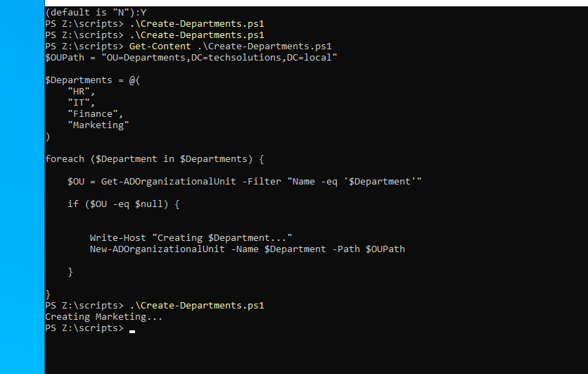

# PowerShell AD Automation

A collection of PowerShell scripts for automating common Active Directory administrative tasks.

---

## Project Structure

```text
powershell-ad-automation/
│
├── data/
├── images/
├── scripts/
│   └── Create-Departments.ps1
│
└── README.md
```

---

# Scripts

## Create-Departments.ps1

### Description

Creates multiple Organizational Units (OUs) in Active Directory automatically.

The script checks whether each Organizational Unit already exists before creating it, making it safe to execute multiple times.

### Features

- Creates multiple Organizational Units.
- Uses arrays and `foreach` to process departments.
- Verifies if the OU already exists.
- Prevents duplicate OUs.
- Can be executed multiple times without creating duplicates (idempotent).

### Technologies

- PowerShell
- Active Directory Module
- Windows Server 2022

### Concepts Learned

- Variables
- Arrays
- `foreach`
- `if`
- `$null`
- `Get-ADOrganizationalUnit`
- `New-ADOrganizationalUnit`
- `Write-Host`

### How to Run

```powershell
cd scripts
.\Create-Departments.ps1
```

### Result



---

## Next Steps

- Create Active Directory users automatically.
- Create security groups.
- Import users from CSV files.
- Disable inactive users.
- Automate common Active Directory administrative tasks.